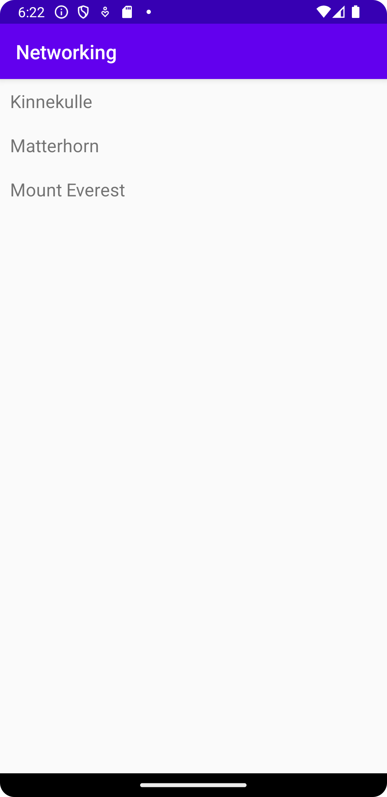

Först så forkades projektet "Networking" som länkats i uppgiftsbeskrivningen. 
Efter det skapades en "RecyclerWiew" till min layout fil "activity_main":

<androidx.recyclerview.widget.RecyclerView
android:id="@+id/recycler_view"
android:layout_width="match_parent"
android:layout_height="match_parent"
app:layout_constraintBottom_toBottomOf="parent"
app:layout_constraintLeft_toLeftOf="parent"
app:layout_constraintRight_toRightOf="parent"
app:layout_constraintTop_toTopOf="parent" />
</androidx.constraintlayout.widget.ConstraintLayout>

Efter det lades det till en ArrayList<Mountain> och en RecyclerView.Adapter. Dessa skrevs
Såhär:

ArrayList<Mountain> mountain = new ArrayList<Mountain>();

RecyclerViewAdapter adapter;

Efter detta Skapade jag två nya klasser som hette "Mountain" och "RecyclerViewAdapter".

I mountainklassen skapades bland annat en variabel med datatypen string och identifieraren
"name".

Efter detta användes getJson() för att ladda ner datan från json filen. Samt att URLen 
ändrades till den url som tillhör jsonfilen:

private final String JSON_URL = "https://mobprog.webug.se/json-api?login=brom";

Efter detta använde jag toString() som jag overridade för att få namnen på bergen till
strings. När jag sedan testade appen visades inga berg och det märktes att det inte
några berg i variabeln mountains. Efter mycket debuggande märktes det att felet fanns i
denna rad:

Toast.makeText(MainActivity.this, item.toString(), Toast.LENGTH_SHORT).show();

Där jag innan hade skrivit "getName" istället för "toString" Detta ledde till att
den aldrig hämtade stringvärderna som hade skapats.

Tyvärr visades bara tra av de fyra bergen som skulle visas på skärmen, anledningen var
att nu hade Json filen kommit in men inte json URLen. Då skrevs denna kod i MainActivity:

new JsonTask(this).execute(JSON_URL);

Tyvärr gjorde detta inte så att listan uppdaterades med alla berg och den såg likadan
ut som förut. Jag testade då att flytta runt de olika kodraderna i MainActivity men det
fungerade inte. Jag kom då till slutsatsen att det var en racecondition som gjorde 
att listan inte uppdaterades korrekt.

